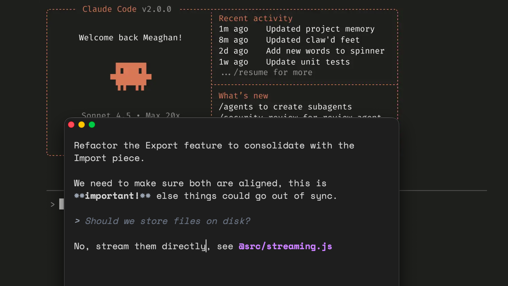

Lightweight prompt editor for [Claude Code](https://claude.ai/claude-code) with a macOS native interface.



## How it works

Hit `Ctrl+G` in Claude Code to edit your prompt in an overlay window:

- Edit prompts outside your terminal, with your keyboard and... mouse 🤯
- `@file` autocomplete
- `Cmd+S` to save and submit

Also:

- Syntax highlighting
- Light/dark theme that matches your system
- Window position and size remembered between sessions

## Install

```bash
brew install mnapoli/tap/promptedit
```

<details>
<summary>Install from DMG</summary>

Download the `.dmg` from [Releases](../../releases), open it, drag PromptEdit to Applications, then add it to your PATH:

```bash
ln -s /Applications/PromptEdit.app/Contents/MacOS/PromptEdit /usr/local/bin/promptedit
```
</details>

<details>
<summary>Build from source</summary>

```bash
npm install
npm run tauri build
# Binary at src-tauri/target/release/promptedit
```
</details>

## Setup

Add to `~/.claude/settings.json`:

```json
{
  "env": {
    "EDITOR": "promptedit"
  }
}
```

Then press `Ctrl+G` in Claude Code to open PromptEdit.
